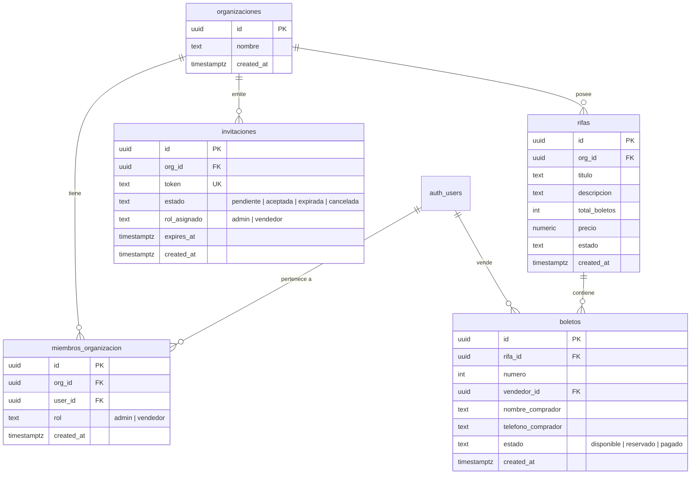

# Plan de Arquitectura: Transformación SaaS Multi-Tenant con RBAC (Supabase + React)

Este documento detalla la arquitectura técnica y el plan de migración para convertir la aplicación actual de gestión de rifas en un **SaaS multi-inquilino (multi-tenant)** con **Control de Acceso Basado en Roles (RBAC)** utilizando Supabase (PostgreSQL + RLS) y React.

---

## 1. Análisis del Estado Actual vs. Arquitectura Objetivo

### Estado Actual
- **Monousuario / Monotenant:** Las tablas actuales (`vendidos`, `users`) operan sin segmentación por organización.
- **Autorización acoplada:** Validación de administradores mediante una lista estática en frontend (`ADMIN_EMAILS` en `AuthContext.jsx`) y campo `role` en la tabla plana `users`.
- **Rutas simples:** Rutas protegidas únicamente por presencia de sesión en `ProtectedRoute.jsx`.

### Arquitectura Objetivo (Multi-Tenant RBAC)
- **Aislamiento lógico de datos (Tenant Isolation):** Cada entidad de negocio (`rifas`, `boletos`, `invitaciones`) pertenece a un `org_id` referenciado a la tabla `organizaciones`.
- **RBAC Jerárquico en Supabase:** Roles `'admin'` y `'vendedor'` asignados por organización en la tabla asociativa `miembros_organizacion`.
- **Seguridad en Capa de Datos (RLS + Security Definer Functions):** Políticas Row Level Security de PostgreSQL que garantizan que ningún usuario pueda consultar o mutar datos fuera de su organización, evitando bucles de recursión infinita mediante funciones `SECURITY DEFINER`.
- **Frontend desacoplado y reactivo:** `OrganizationContext` y hook `useOrganization` para gestionar la organización activa y el rol del usuario, complementados por `RoleGuard` para enrutamiento basado en permisos.
- **Ciclo de vida seguro de invitaciones:** Creación de tokens con expiración y función RPC atómica `accept_invitation` para canjear invitaciones sin exponer llaves maestras.

---

## 2. Modelo de Datos y Script SQL de Migración

### Entidades y Relaciones



### Estrategia de RLS y Funciones de Seguridad (Anti-Recursión)

> [!IMPORTANT]
> Consultar `miembros_organizacion` directamente dentro de una política RLS sobre la misma tabla `miembros_organizacion` produce el error de PostgreSQL `infinite recursion detected in policy for relation`.
> Para solucionar esto de manera óptima y de alto rendimiento, se implementarán funciones `SECURITY DEFINER`:
> - `get_user_org_ids()`: Retorna los UUIDs de las organizaciones del usuario actual (`auth.uid()`).
> - `is_org_admin(org_uuid)`: Retorna `true` si el usuario actual es `'admin'` en esa organización.
> - `is_org_member(org_uuid)`: Retorna `true` si el usuario pertenece a la organización.

#### Políticas RLS Propuestas:
1. **`organizaciones`:**
   - `SELECT`: Usuarios que pertenezcan a la organización (`id IN (SELECT get_user_org_ids())`).
   - `UPDATE` / `DELETE`: Administradores de la organización (`is_org_admin(id)`).
   - `INSERT`: Usuarios autenticados (para crear su propia organización inicial).
2. **`miembros_organizacion`:**
   - `SELECT`: Miembros de la misma organización (`org_id IN (SELECT get_user_org_ids())`).
   - `ALL` (Insert/Update/Delete): Solo administradores de la organización (`is_org_admin(org_id)`).
3. **`invitaciones`:**
   - `SELECT` (Admin): Administradores de la organización (`is_org_admin(org_id)`).
   - `SELECT` (Público/Token): Lectura permitida si `estado = 'pendiente' AND expires_at > now()` para validar la invitación en el frontend.
   - `INSERT` / `UPDATE` / `DELETE`: Solo administradores (`is_org_admin(org_id)`).
4. **`rifas`:**
   - `SELECT`: Cualquier miembro de la organización (`org_id IN (SELECT get_user_org_ids())`) o visualización pública si la rifa está activa.
   - `INSERT` / `UPDATE` / `DELETE`: Solo administradores (`is_org_admin(org_id)`).
5. **`boletos`:**
   - `SELECT`: Miembros de la organización a la que pertenece la rifa.
   - `INSERT`:
     - Admins: en cualquier boleto de su organización.
     - Vendedores: solo si `vendedor_id = auth.uid()` y la rifa pertenece a su organización.
   - `UPDATE`:
     - Admins: actualización total.
     - Vendedores: solo boletos asignados a ellos (`vendedor_id = auth.uid()`).

---

## 3. Árbol de Proyecto Actualizado

```text
rifa-flecha/
├── .env.example
├── package.json
├── tailwind.config.js
├── supabase/
│   └── migrations/
│       └── 20260911_multitenant_rbac.sql          # [NUEVO] Script SQL completo de migración y RLS
├── public/
└── src/
    ├── App.js
    ├── index.js
    ├── index.css
    ├── config.js
    ├── components/
    │   ├── ProtectedRoute.jsx                      # Ruta protegida base (autenticación)
    │   ├── RoleGuard.jsx                           # [NUEVO] Guard de roles (admin vs vendedor)
    │   └── Rifa/
    │       ├── RifaCard.jsx
    │       └── RifaGrid.jsx
    ├── contexts/
    │   ├── AuthContext.jsx                         # Sesión Supabase
    │   └── OrganizationContext.jsx                 # [NUEVO] Estado de la organización activa y rol
    ├── hooks/
    │   ├── useWindowSize.js
    │   └── useOrganization.js                     # [NUEVO] Hook consumidor de org activa y permisos
    ├── pages/
    │   ├── Admin/
    │   │   ├── Dashboard.jsx                       # Vista exclusiva de administración
    │   │   └── Modals/
    │   │       └── InviteMemberModal.jsx           # [NUEVO] Modal para generar links de invitación
    │   ├── Home/
    │   │   └── Home.jsx                            # Vista pública / catálogo general
    │   ├── Login/
    │   │   └── Login.jsx                           # Login con Google / Magic link
    │   ├── Invitacion/
    │   │   └── AceptarInvitacion.jsx               # [NUEVO] Vista de captura y canje de invitaciones
    │   └── Vendedor/
    │       └── CatalogoVentas.jsx                  # [NUEVO] Portal de ventas exclusivo para vendedores
    ├── router/
    │   └── router-config.js                        # Configuración de rutas con RoleGuard integrado
    └── services/
        ├── supabase.js                             # Cliente Supabase
        └── invitationService.js                    # [NUEVO] Servicio para crear y canjear invitaciones
```

---

## 4. Responsabilidad de Cada Archivo Nuevo

| Archivo | Responsabilidad Principal |
| :--- | :--- |
| `supabase/migrations/20260911_multitenant_rbac.sql` | Esquema DDL completo: tablas `organizaciones`, `miembros_organizacion`, `invitaciones`, adaptación de `rifas` y `boletos`, índices, funciones de seguridad `SECURITY DEFINER`, políticas RLS y procedimiento almacenado `accept_invitation`. |
| `src/contexts/OrganizationContext.jsx` | Provee el estado global de multi-tenancy: lista de organizaciones del usuario, organización actualmente seleccionada, rol en dicha organización y método para alternar entre organizaciones. |
| `src/hooks/useOrganization.js` | Hook accesible para componentes que expone `{ activeOrg, role, isAdmin, isVendedor, loading, switchOrg }`, abstrayendo la lógica del contexto. |
| `src/components/RoleGuard.jsx` | Componente de protección de rutas basado en RBAC. Si el rol es `'vendedor'`, redirige automáticamente a su portal de ventas (`/vendedor`); si es `'admin'`, concede acceso a las rutas protegidas (o viceversa según la configuración). |
| `src/services/invitationService.js` | Funciones cliente para interactuar con la base de datos: generación criptográfica o por token de invitaciones, consulta de metadatos de invitación por token y canje seguro vía RPC. |
| `src/pages/Invitacion/AceptarInvitacion.jsx` | Página de aterrizaje que recibe el parámetro `?token=...` en la URL. Si el usuario no está logueado, permite iniciar sesión; si está logueado, procesa la vinculación a la organización como `'vendedor'` y redirige. |
| `src/pages/Admin/Modals/InviteMemberModal.jsx` | Componente modal para que los administradores generen enlaces de invitación con botón de copiado rápido al portapapeles. |
| `src/pages/Vendedor/CatalogoVentas.jsx` | Vista especializada y optimizada para vendedores de la organización, permitiéndoles registrar boletos vendidos a su nombre y consultar su rendimiento personal. |

---

## 5. Plan de Verificación

### Verificación en Base de Datos (Supabase)
1. Ejecutar el script `20260911_multitenant_rbac.sql` en el SQL Editor de Supabase.
2. Comprobar que no existan errores de recursión en RLS al consultar `miembros_organizacion`.
3. Verificar con dos usuarios de prueba:
   - **Usuario A (Admin):** puede crear rifas, ver todos los boletos y generar invitaciones.
   - **Usuario B (Vendedor):** solo puede ver rifas de la organización y registrar boletos donde `vendedor_id = auth.uid()`.

### Verificación Frontend
1. **Flujo de Invitación:** Generar un token con el usuario Admin, copiar el link, abrir en ventana de incógnito, iniciar sesión con Usuario B y verificar que quede registrado como `'vendedor'`.
2. **RoleGuard:** Navegar a `/admin` con Usuario B y verificar redirección a `/vendedor`. Navegar con Usuario A y confirmar acceso pleno al Dashboard.
